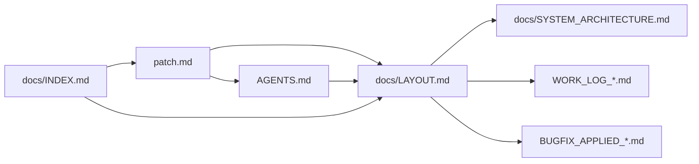
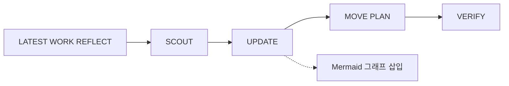
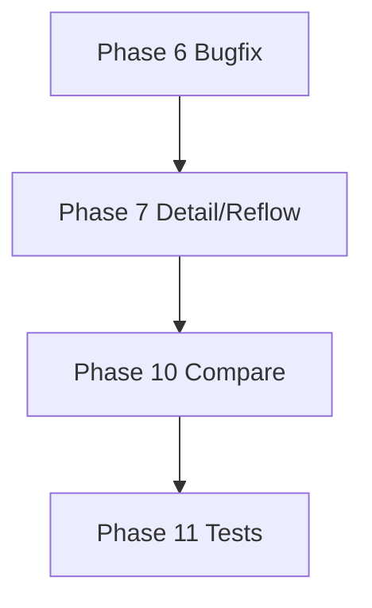
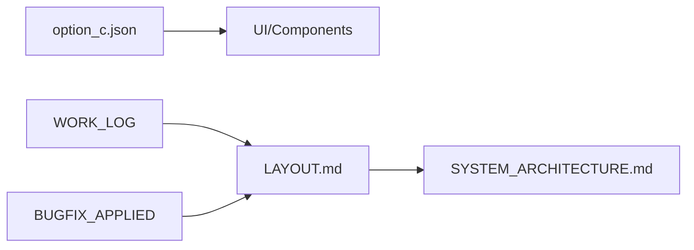

# DocOps — Mermaid 그래프 가이드

필요 시 Mermaid 스타일 그래프를 만들고 문서에 삽입한다. Markdown 내 ` ```mermaid ` 블록 사용.

## 1. 문서 REF/참조 관계 (graph LR 또는 TB)



- **용도**: docs/INDEX.md, LAYOUT.md, _meta/reports 등에 문서 간 참조 관계 시각화.
- **노드**: 문서명(파일명). 링크가 필요하면 `[텍스트](경로)` 대신 노드 ID만 쓰고 본문에 표 목록으로 링크.

## 2. DocOps 워크플로우 (flowchart)



- **용도**: docops-autopilot 실행 순서, DocOps 스킬 설명.
- **스타일**: flowchart LR(좌→우) 또는 TB(위→아래). 점선 `-.->` 는 선택 단계.

## 3. Phase/의존성 (graph TD)



- **용도**: WORK_LOG/plan 문서에 Phase 순서·의존성 표시.

## 4. 데이터/상태 흐름 (flowchart)



- **용도**: SSOT → UI, 또는 최신 작업 소스 → 문서 반영 흐름.

## 5. 규칙

- **삽입 위치**: 문서 상단(목차 아래) 또는 해당 섹션 직후. 중복 그래프는 피한다.
- **크기**: 노드 수가 많으면 `graph TB` 또는 서브그래프로 나누어 가독성 유지.
- **일관성**: 동일한 종류의 관계는 동일한 화살표 스타일(실선/점선) 사용.
- **필요 시에만**: 관계가 복잡하거나 워크플로우 설명이 도움될 때 삽입. 모든 문서에 강제하지 않는다.

## 6. 참고

- [Mermaid 공식 문법](https://mermaid.js.org/syntax/flowchart.html): flowchart, graph, sequenceDiagram 등.
- GitHub/GitLab, VS Code, Cursor에서 ` ```mermaid ` 블록은 미리보기 지원.
