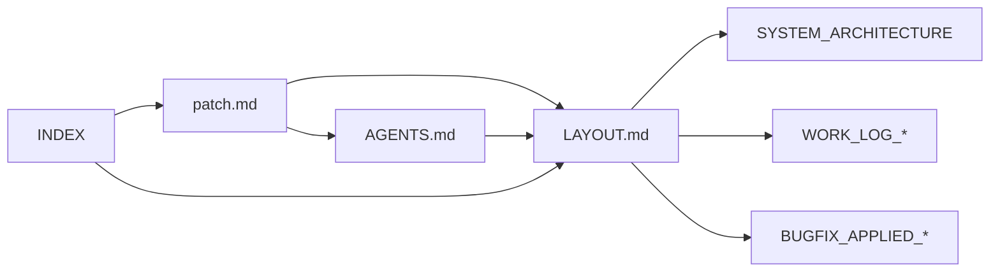

# Docs Index

문서 진입점. SSOT 우선으로 정렬. **각 문서는 최신 작업 내용(WORK_LOG/BUGFIX/plan)을 반영하도록 유지한다.**

**최신 작업 소스**: [WORK_LOG_20260202](WORK_LOG_20260202.md), [BUGFIX_APPLIED_20260202](BUGFIX_APPLIED_20260202.md), [IMPLEMENTATION_SUMMARY](IMPLEMENTATION_SUMMARY.md), [plan/](plan/)

### 문서 REF 관계 (Mermaid)

## 1. SSOT / 계약 (루트)

| 문서 | 설명 |
|------|------|
| [patch.md](../patch.md) | UI/UX 패치 스펙 (SSOT) |
| [patch4.md](../patch4.md) | 패치 v4 상세 |
| [AGENTS.md](../AGENTS.md) | 에이전트 규칙·워크플로우 |

## 2. 설계 / 레이아웃 (docs)

| 문서 | 설명 |
|------|------|
| [LAYOUT.md](LAYOUT.md) | 레이아웃·3열·반응형 계약 |
| [SYSTEM_ARCHITECTURE.md](SYSTEM_ARCHITECTURE.md) | 시스템 아키텍처 |

## 3. 계획·검증 (docs/plan)

| 문서 | 설명 |
|------|------|
| [tr-dashboard-plan.md](plan/tr-dashboard-plan.md) | 대시보드 계획 |
| [tr-dashboard-plan-patch4.md](plan/tr-dashboard-plan-patch4.md) | 패치4 계획 |
| [tr-dashboard-verification-report.md](plan/tr-dashboard-verification-report.md) | 검증 리포트 |
| [vis-timeline-gantt-integration-plan.md](plan/vis-timeline-gantt-integration-plan.md) | Gantt 연동 계획 |

## 4. 가이드 (docs/guides)

| 문서 | 설명 |
|------|------|
| [patch-guide.md](guides/patch-guide.md) | 패치 적용 가이드 |
| [tr-subagents.md](guides/tr-subagents.md) | TR 서브에이전트 |
| [agi-schedule-updater.md](guides/agi-schedule-updater.md) | AGI 스케줄 업데이터 |
| [termux-ssh-cursor.md](guides/termux-ssh-cursor.md) | Termux/SSH/Cursor |

## 5. 작업·버그픽스 (docs)

| 문서 | 설명 |
|------|------|
| [WORK_LOG_20260202.md](WORK_LOG_20260202.md) | 작업 로그 |
| [BUGFIX_APPLIED_20260202.md](BUGFIX_APPLIED_20260202.md) | 버그픽스 적용 |
| [IMPLEMENTATION_SUMMARY.md](IMPLEMENTATION_SUMMARY.md) | 구현 요약 |

## 6. 기타

| 문서 | 설명 |
|------|------|
| [CURSOR_UPDATE_GUIDE.md](CURSOR_UPDATE_GUIDE.md) | Cursor 업데이트 |
| [AGENT_DASHBOARD_INTEGRATION.md](AGENT_DASHBOARD_INTEGRATION.md) | 에이전트·대시보드 연동 |
| [VERCEL.md](VERCEL.md) | 배포(Vercel) |
| [00_INBOX/chat/](00_INBOX/chat/README.md) | 대화 요약·메모 |

## 7. DocOps 메타

| 경로 | 설명 |
|------|------|
| [_meta/inventory/](_meta/inventory/) | 문서 인벤토리 |
| [_meta/plans/](_meta/plans/) | 이동·변경 계획 |
| [_meta/reports/](_meta/reports/) | 검증 리포트 |

---

## Refs

- [patch.md](../patch.md)
- [AGENTS.md](../AGENTS.md)
- [LAYOUT.md](LAYOUT.md)
- [SYSTEM_ARCHITECTURE.md](SYSTEM_ARCHITECTURE.md)
