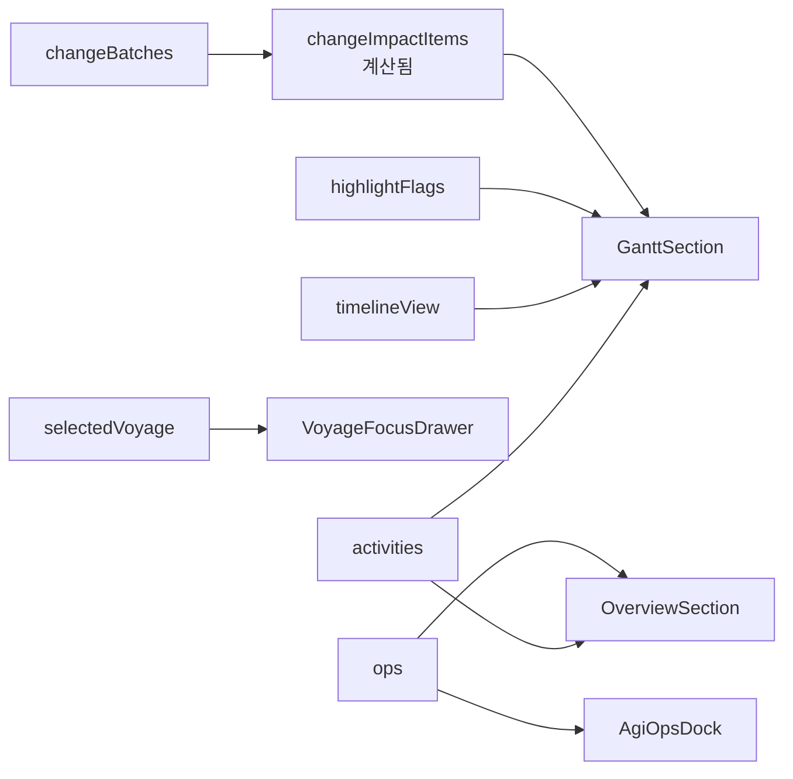
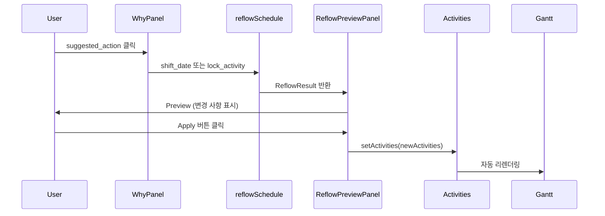

# HVDC TR Transport Dashboard - Layout 문서

> **버전**: 1.4.0  
> **최종 업데이트**: 2026-02-02 (Phase 6: Bugfix + Phase 5: SSOT Upgrade v1.0)  
> **최신 작업 반영**: 2026-02-03 — [WORK_LOG_20260202](WORK_LOG_20260202.md) (Phase 6 Bugfix #1~5,#7, Phase 7/10/11), [BUGFIX_APPLIED_20260202](BUGFIX_APPLIED_20260202.md)  
> **프로젝트**: HVDC TR Transport Dashboard - AGI Site  
> **SSOT**: patch.md, option_c.json (AGENTS.md)

---

## 목차

1. [시스템 개요](#시스템-개요)
2. [전체 레이아웃 구조](#전체-레이아웃-구조)
3. [컴포넌트 계층 구조](#컴포넌트-계층-구조)
4. [상태 관리](#상태-관리)
5. [스타일링 시스템](#스타일링-시스템)
6. [섹션별 상세 설명](#섹션별-상세-설명)
7. [반응형 레이아웃](#반응형-레이아웃)
8. [파일 구조](#파일-구조)

---

## 시스템 개요

HVDC TR Transport Dashboard는 **Al Ghallan Island (AGI) Site**의 7개 Transformer Units 운송을 관리하는 실시간 물류 대시보드입니다.

**운영 규모**: 1 Trip당 1 TR 운송, 총 7 Trip, SPMT 1기 운영

### 핵심 특징

- **3-Column Layout (patch.md §2.1)**: Map | Timeline | Detail(State/Risk)
- **단일 시선 흐름**: Location → Schedule → Verification (3초 내 읽기). Phase 6에서 UI 가이드 문구 제거 완료 — StoryHeader·3열 라벨은 Location/Schedule/Verification, Map/Timeline 사용.
- **2-click Collision UX**: 배지 → Why 패널 → Root cause + Evidence
- **Compare Mode** (patch.md §2.2): baseline vs compare delta overlay, Gantt ghost bars
- **Sticky Navigation**: 섹션 간 빠른 이동
- **Dark Mode**: Deep Ocean 테마 적용
- **AGI Operations**: 스케줄 업데이트 및 명령 처리

---

## 전체 레이아웃 구조

### 레이아웃 다이어그램 (patch.md §2.1)

```mermaid
graph TB
    RootLayout[app/layout.tsx<br/>RootLayout]
    RootLayout --> Page[app/page.tsx<br/>DateProvider + DashboardLayout]
    
    Page --> Header[DashboardHeader]
    Page --> StoryHeader[StoryHeader<br/>Location/Schedule/Verification]
    Page --> Overview[OverviewSection]
    Page --> SectionNav[SectionNav]
    Page --> TrLayout[TrThreeColumnLayout<br/>Map | Timeline | Detail]
    Page --> Footer[Footer]
    Page --> VoyageDrawer[VoyageFocusDrawer]
    
    TrLayout --> MapSlot[mapSlot<br/>MapPanelWrapper + VoyagesSection]
    TrLayout --> TimelineSlot[timelineSlot<br/>ScheduleSection + GanttSection]
    TrLayout --> DetailSlot[detailSlot]
    
    DetailSlot --> DetailPanel[DetailPanel<br/>ActivityHeader, State, PlanVsActual, Resources, Constraints, CollisionTray]
    DetailSlot --> WhyPanel[WhyPanel<br/>2-click: root cause + suggested_actions]
    DetailSlot --> ReflowPreview[ReflowPreviewPanel<br/>onApplyAction → reflowSchedule]
    DetailSlot --> HistoryEvidence[HistoryEvidencePanel<br/>History | Evidence | Compare Diff | Trip Closeout]
    DetailSlot --> ReadinessPanel[ReadinessPanel<br/>Ready/Not Ready, milestones, missing evidence]
    DetailSlot --> NotesDecisions[NotesDecisions]
    
    style TrLayout fill:#06b6d4,color:#fff
    style DetailSlot fill:#0891b2,color:#fff
```

### 페이지 구조 (위에서 아래로)

```
┌─────────────────────────────────────────────────────────┐
│ DashboardHeader (제목, DatePicker)                        │
├─────────────────────────────────────────────────────────┤
│ StoryHeader (Location / Schedule / Verification)          │
├─────────────────────────────────────────────────────────┤
│ OverviewSection (OperationOverviewRibbon, MilestoneTracker, AgiOpsDock*, AgiScheduleUpdaterBar) │
│ *AgiOpsDock: BulkAnchors 기본 숨김 (showBulkAnchors=false)                                      │
├─────────────────────────────────────────────────────────┤
│ SectionNav (Overview, KPI, Alerts, Voyages, Schedule, Gantt) │
├─────────────────────────────────────────────────────────┤
│ KPISection | AlertsSection                               │
├─────────────────────────────────────────────────────────┤
│ TrThreeColumnLayout (patch.md §2.1)                      │
│ ┌──────────────┬─────────────────────┬────────────────┐ │
│ │ Map          │ Timeline            │ Detail         │ │
│ │ min 180px    │ 2fr                  │ min 200px      │ │
│ │              │                      │                │ │
│ │ MapPanel     │ ScheduleSection      │ DetailPanel    │ │
│ │ VoyagesSection│ GanttSection        │ WhyPanel       │ │
│ │              │ (compareDelta→ghost bars)│ CompareModeBanner (Compare 모드) │ │
│ │              │                      │ ReflowPreviewPanel │
│ │              │                      │ HistoryEvidencePanel (History | Evidence | Compare Diff | Trip Closeout) │
│ │              │                      │ ReadinessPanel │
│ │              │                      │ NotesDecisions │ │
│ └──────────────┴─────────────────────┴────────────────┘ │
├─────────────────────────────────────────────────────────┤
│ Footer | BackToTop                                       │
└─────────────────────────────────────────────────────────┘
```

---

## 컴포넌트 계층 구조

### 1. RootLayout (`app/layout.tsx`)

**역할**: 최상위 HTML 구조 및 전역 설정

**주요 기능**:
- HTML 루트 요소 (`<html lang="en" className="dark">`)
- 폰트 설정 (Plus Jakarta Sans, JetBrains Mono)
- Vercel Analytics 통합
- 전역 CSS 적용

**코드 구조**:
```tsx
<RootLayout>
  <html lang="en" className="dark">
    <body>
      {children}
      <AnalyticsWrapper />
    </body>
  </html>
</RootLayout>
```

### 2. DashboardLayout (`components/layout/DashboardLayout.tsx`)

**역할**: Global Control Bar + ViewModeProvider (patch.md §2.1)

**구성**:
- GlobalControlBar: Trip/TR 선택, **View 버튼** (Phase 6 Bug #3: 클릭 시 `id="schedule"` Detailed Voyage Schedule 섹션으로 스크롤), Date Cursor, View Mode, Risk Overlay. **Phase 6 Bug #2**: API 실패/7개 미만 시 voyages 기반 fallback으로 trips/trs 7개 노출, selectedVoyage ↔ selectedTripId/selectedTrIds 동기화.
- ViewModeProvider: Live/History/Approval/Compare 모드

### 3. Page Component (`app/page.tsx`)

**역할**: 메인 페이지 컴포넌트 및 상태 관리

### 주요 상태**:
- `activities`: 스케줄 활동 배열 (ScheduleActivity[])
- `activeSection`: 현재 활성 섹션 ID
- `timelineView`: 타임라인 뷰 모드 (Week/Month/Quarter)
- `selectedVoyage`: 선택된 항차 정보
- `selectedActivityId`: 선택된 활동 ID (DetailPanel 표시)
- `selectedCollision`: 선택된 충돌 (WhyPanel 표시)
- `reflowPreview`: Why 패널 suggested_action → reflowSchedule 결과
- `changeBatches`: 변경 이력 스택 (Undo 지원)
- `ops`: AGI Operations 상태
- `viewMode`: Live/History/Approval/Compare (ViewModeStore)

**컨테이너 설정**:
- `max-w-[1800px]`: 최대 너비 1800px
- `mx-auto`: 중앙 정렬
- `px-4 sm:px-6`: 반응형 패딩
- `py-6`: 세로 패딩

### 4. DashboardHeader (`components/dashboard/header.tsx`)

**역할**: 대시보드 헤더 및 프로젝트 정보 표시

**구성 요소**:
- 제목: "HVDC TR Transport" (Ship 아이콘 포함)
- 프로젝트 정보: "AGI Site | 7 Transformer Units | LCT BUSHRA"
- 상태 배지: "Confirmed" (애니메이션 펄스)
- 완료일: "March 22, 2026"
- DatePicker: 날짜 선택 컴포넌트. **Phase 6 Bug #1**: Selected Date는 UTC 기준(YYYY-MM-DD)으로 Gantt 축과 정렬. `dateToIsoUtc`, `toUtcNoon` 사용. 라벨에 (YYYY-MM-DD), tooltip "Selected date: YYYY-MM-DD (UTC day index used for Gantt)" 표시.

**스타일링**:
- `bg-glass`: 반투명 배경
- `backdrop-blur-xl`: 블러 효과
- `shadow-glow`: 글로우 그림자
- 그라데이션 텍스트 (cyan-400 → teal-400)

### 5. OverviewSection (`components/dashboard/sections/overview-section.tsx`)

**역할**: 운영 개요 및 AGI Operations

**구성 요소**:
1. **OperationOverviewRibbon**: 충돌 카운트 표시
2. **MilestoneTracker**: 마일스톤 추적
3. **AgiOpsDock**: AGI 명령 처리 인터페이스
4. **AgiScheduleUpdaterBar**: 스케줄 업데이트 바

**Props**:
- `activities`: 스케줄 활동 배열
- `ops`: AGI Operations 상태
- `onApplyActivities`: 활동 적용 핸들러
- `onSetActivities`: 활동 설정 핸들러
- `onOpsCommand`: AGI 명령 실행 핸들러
- `onFocusActivity`: 활동 포커스 핸들러

### 6. SectionNav (`components/dashboard/section-nav.tsx`)

**역할**: 섹션 간 네비게이션 (Sticky)

**특징**:
- `sticky top-0 z-20`: 상단 고정
- 스크롤 시 활성 섹션 자동 감지
- 섹션별 카운트 표시 (KPI: 6, Alerts: 2, Voyages: 7, etc.)
- 부드러운 스크롤 이동

**섹션 목록**:
1. Overview
2. KPI (count: 6)
3. Alerts (count: 2)
4. Voyages (count: 7)
5. Schedule (count: 활동 수)
6. Gantt

### 7. TrThreeColumnLayout (`components/dashboard/layouts/tr-three-column-layout.tsx`)

**역할**: 3-Column Layout (patch.md §2.1) — Map | Timeline | Detail. Phase 6: UI 라벨은 "Map", "Timeline" (WHERE/WHEN/WHAT 제거됨).

**레이아웃 구조**:
```tsx
<div className="grid gap-4 lg:grid-cols-[minmax(180px,1fr)_2fr_minmax(200px,1fr)]">
  <aside aria-label="Map">{mapSlot}</aside>
  <main aria-label="Timeline">{timelineSlot}</main>
  <aside aria-label="Detail">{detailSlot}</aside>
</div>
```

**detailSlot 구성**:
- DetailPanel (ActivityHeader, StateSection, PlanVsActualSection, ResourcesSection, ConstraintsSection, CollisionTray)
- WhyPanel (2-click: root_cause_code, suggested_actions)
- ReflowPreviewPanel (onApplyAction → reflowSchedule → Preview UI)
- HistoryEvidencePanel (History | Evidence | Compare Diff | Trip Closeout)
  - HistoryTab: Add event (note, delay, decision 등), append-only
  - EvidenceTab: Add link (URL/경로), Evidence checklist
  - CompareDiffPanel: Baseline vs Current diff 테이블 (Phase 6: Baseline snapshot / Compare as-of 표시)
  - TripCloseoutForm: Trip Report Export (MD/JSON)
- ReadinessPanel: Ready/Not Ready 배지, milestones, missing evidence, blockers
- NotesDecisions

**반응형**:
- `lg:` 브레이크포인트 이상: 3-Column Grid
- `lg:` 미만: 단일 컬럼

### 8. ResourceUtilizationPanel (`components/dashboard/resource-utilization-panel.tsx`)

**역할**: 좌측 패널 - 자원 활용도 및 필터링

**기능**:
- 자원별 활동 카운트 표시
- 활용도 퍼센트 표시
- 자원 필터링 (클릭 시 필터 적용)
- Reset 버튼 (필터 초기화)

**스타일링**:
- `sticky top-24`: 상단에서 24px 고정
- `bg-card/80`: 반투명 카드 배경
- `backdrop-blur-lg`: 블러 효과

### 9. NotesDecisions (`components/dashboard/notes-decisions.tsx`)

**역할**: 우측 패널 - 노트 및 결정사항

**기능**:
- 접기/펼치기 토글
- 노트 목록 표시
- 타임스탬프 표시

**데이터 구조** (현재 하드코딩):
```tsx
const notes = [
  { title: "Weather window", detail: "...", time: "Today" },
  { title: "Port congestion", detail: "...", time: "Jan 21" },
  { title: "Crew rotation", detail: "...", time: "Jan 20" },
]
```

---

## 상태 관리

### Page Component 상태

```tsx
// 스케줄 데이터
const [activities, setActivities] = useState(scheduleActivities)

// UI 상태
const [activeSection, setActiveSection] = useState("overview")
const [timelineView, setTimelineView] = useState<TimelineView>("Week")
const [highlightFlags, setHighlightFlags] = useState<HighlightFlags>({...})
const [selectedVoyage, setSelectedVoyage] = useState<...>(null)

// 변경 이력
const [changeBatches, setChangeBatches] = useState<ChangeBatch[]>([])

// AGI Operations
const [ops, setOps] = useState(() => createDefaultOpsState(...))
```

### 상태 흐름



### 자동 계산 로직

**충돌 감지** (`useEffect`):
```tsx
useEffect(() => {
  setConflicts(detectResourceConflicts(activities))
}, [activities])
```

**변경 이력 플래튼화** (`useMemo`):
```tsx
const changeImpactItems = useMemo(() => {
  const flattened = changeBatches.flatMap((batch) =>
    batch.changes.map((change) => ({
      ...change,
      appliedAt: batch.appliedAt,
    }))
  )
  return flattened.slice(-MAX_CHANGE_STACK).reverse()
}, [changeBatches])
```

**활성 섹션 감지** (`useEffect`):
```tsx
useEffect(() => {
  const ids = ["overview", "kpi", "alerts", "voyages", "schedule", "gantt"]
  const handler = () => {
    const scrollPosition = window.scrollY + 120
    let current = ids[0]
    for (const id of ids) {
      const el = document.getElementById(id)
      if (el && el.offsetTop <= scrollPosition) {
        current = id
      }
    }
    setActiveSection(current)
  }
  handler()
  window.addEventListener("scroll", handler)
  return () => window.removeEventListener("scroll", handler)
}, [])
```

---

## 스타일링 시스템

### 테마: Deep Ocean

**색상 팔레트** (OKLCH):
- **Background**: `oklch(0.12 0.02 250)` - 어두운 바다색
- **Foreground**: `oklch(0.95 0.01 250)` - 밝은 텍스트
- **Primary**: `oklch(0.72 0.15 195)` - Cyan/Teal
- **Accent**: `oklch(0.72 0.15 195 / 0.15)` - 반투명 Cyan

**폰트**:
- **Sans**: Plus Jakarta Sans
- **Mono**: JetBrains Mono

### 커스텀 유틸리티 클래스

```css
.bg-glass {
  background: rgba(30, 41, 59, 0.6);
  backdrop-filter: blur(20px);
}

.shadow-glow {
  box-shadow: 0 0 40px rgba(6, 182, 212, 0.15);
}

.shadow-cyan {
  box-shadow: 0 4px 20px rgba(6, 182, 212, 0.35);
}
```

### 배경 효과

**그리드 패턴**:
```css
body::before {
  background-image: 
    linear-gradient(rgba(6, 182, 212, 0.03) 1px, transparent 1px),
    linear-gradient(90deg, rgba(6, 182, 212, 0.03) 1px, transparent 1px);
  background-size: 60px 60px;
}
```

**그라데이션 배경**:
```css
body {
  background: linear-gradient(145deg, #0a0f1a 0%, #0c1929 40%, #0f172a 100%);
}
```

### 스크롤바 커스터마이징

```css
::-webkit-scrollbar {
  width: 8px;
  height: 8px;
}

::-webkit-scrollbar-thumb {
  background: #0891b2;
  border-radius: 4px;
}
```

---

## 섹션별 상세 설명

### 1. Overview Section (`id="overview"`)

**위치**: Header 바로 아래

**구성 요소**:
1. **OperationOverviewRibbon**
   - 상태 요약 표시

2. **MilestoneTracker**
   - 프로젝트 마일스톤 추적
   - 진행률 표시

3. **AgiOpsDock**
   - AGI 명령 처리 인터페이스
   - BulkAnchors 기본 숨김 (showBulkAnchors=false)
   - 활동 검색 및 필터링, 활동 포커스 기능

4. **AgiScheduleUpdaterBar**
   - 스케줄 업데이트 명령 입력
   - 변경사항 미리보기
   - 적용/취소 기능

### 2. KPI Section (`id="kpi"`)

**위치**: DashboardShell Main Content 첫 번째

**구성 요소**:
- **KPICards**: 6개의 KPI 카드
  - 각 카드는 메트릭, 트렌드, 상태 표시

### 3. Alerts Section (`id="alerts"`)

**위치**: KPI Section 아래

**구성 요소**:
- **AlertsTriage**: 알림 트리지 시스템
  - **GoNoGoBadge**: Sea Transit Go/No-Go 결정 (GO|NO-GO|CONDITIONAL)
    - 데이터: `data/schedule/go_nogo.json`
  - **WeatherBlock**: Weather & Marine Risk (4일치 D~D+3, Last Updated)
    - 데이터: `data/schedule/weather.json`
  - **OperationalNotice**: 운영 공지
  - 우선순위별 분류, 알림 카운트 표시

### 4. Voyages Section (`id="voyages"`)

**위치**: Alerts Section 아래

**구성 요소**:
- **VoyageCards**: 7개 항차 카드
  - 각 항차별 정보 표시
  - 클릭 시 VoyageFocusDrawer 열림
- **TideTable**: 각 VoyageCard 하단에 물때 상위 3시간대 표시
  - 데이터: `data/schedule/tide.json` (WATER TIDE.csv 파싱 결과)
  - 형식: 3행 `HH:00` / `X.XXm` (DASHBOARD_OUTPUT_SCHEMA)

**상호작용**:
- 항차 카드 클릭 → `setSelectedVoyage(voyage)`
- VoyageFocusDrawer 표시

### 5. Schedule Section (`id="schedule"`)

**위치**: Voyages Section 아래

**구성 요소**:
- **ScheduleTable**: 스케줄 테이블
  - 활동 목록 표시
  - 날짜/시간 정보
  - 자원 태그 표시

### 6. Gantt Section (`id="gantt"`)

**위치**: Schedule Section 아래 (마지막)

**구성 요소**:
1. **TimelineControls**
   - 뷰 모드 전환 (Week/Month/Quarter)
   - 하이라이트 플래그 토글
   - 날짜 점프 기능

2. **GanttChart**
   - 타임라인 차트
   - 활동 바 표시
   - **Phase 6 Bug #1**: Selected Date는 UTC 기준(YYYY-MM-DD). `formatShortDateUtc`, `getDatePosition(toUtcNoon(date))` 사용. Gantt 날짜 축과 정렬.
   - **compareDelta** (Phase 10): Compare 모드 시 ghost bars (changed 활동 노란 점선)
   - 스크롤 및 줌 기능

**Props**:
- `activities`: 스케줄 활동 배열
- `view`: 타임라인 뷰 모드
- `highlightFlags`: 하이라이트 플래그
- `changeImpactItems`: 변경 영향 항목
- `onUndoChangeImpact`: 변경 취소 핸들러

---

## 반응형 레이아웃

### 브레이크포인트

**Desktop (lg 이상, ≥1024px)**:
- 3-Column Grid: `240px - Flexible - 240px`
- 모든 패널 표시
- Sticky 패널 활성화

**Tablet (md, 768px~1023px)**:
- 2-Column 또는 단일 컬럼 (추정)
- 패널 축소 또는 숨김

**Mobile (sm 이하, <768px)**:
- 단일 컬럼 레이아웃
- 패널 접기/펼치기
- 터치 최적화

### Sticky 요소

1. **SectionNav**: `sticky top-0 z-20`
2. **ResourceUtilizationPanel**: `sticky top-24`
3. **NotesDecisions**: `sticky top-24`

### 컨테이너 너비

- **최대 너비**: `1800px` (`max-w-[1800px]`)
- **중앙 정렬**: `mx-auto`
- **패딩**: `px-4 sm:px-6` (모바일: 16px, 데스크톱: 24px)

---

## 파일 구조

```
app/
├── layout.tsx              # RootLayout
├── page.tsx               # Page Component (메인)
└── globals.css            # 전역 스타일

components/
├── dashboard/
│   ├── header.tsx         # DashboardHeader
│   ├── StoryHeader.tsx    # Location/Schedule/Verification
│   ├── section-nav.tsx    # SectionNav
│   ├── footer.tsx         # Footer
│   ├── back-to-top.tsx    # BackToTop
│   ├── voyage-focus-drawer.tsx
│   ├── layouts/
│   │   ├── dashboard-shell.tsx
│   │   └── tr-three-column-layout.tsx  # Map | Timeline | Detail
│   ├── sections/
│   │   ├── overview-section.tsx
│   │   ├── kpi-section.tsx
│   │   ├── alerts-section.tsx
│   │   ├── voyages-section.tsx
│   │   ├── schedule-section.tsx
│   │   └── gantt-section.tsx
│   ├── WhyPanel.tsx       # 2-click: root cause + suggested_actions
│   ├── ReflowPreviewPanel.tsx  # onApplyAction → reflowSchedule
│   ├── ReadinessPanel.tsx      # Next Trip Readiness
│   ├── notes-decisions.tsx
│   ├── gantt-chart.tsx
│   └── ...
├── detail/
│   ├── DetailPanel.tsx    # ActivityHeader, State, PlanVsActual, Resources, Constraints, CollisionTray
│   ├── CollisionTray.tsx
│   ├── CollisionCard.tsx
│   └── sections/
│       ├── ActivityHeader.tsx
│       ├── StateSection.tsx
│       ├── PlanVsActualSection.tsx
│       ├── ResourcesSection.tsx
│       └── ConstraintsSection.tsx
├── history/
│   ├── HistoryEvidencePanel.tsx  # History | Evidence | Compare Diff | Trip Closeout
│   ├── HistoryTab.tsx            # Add event (append-only)
│   ├── TripCloseoutForm.tsx      # Trip Report Export (MD/JSON)
│   └── ...
├── evidence/
│   └── EvidenceTab.tsx           # Evidence checklist + Add link (URL)
├── compare/
│   ├── CompareDiffPanel.tsx      # Baseline vs Current diff
│   └── CompareModeBanner.tsx
├── map/
│   ├── MapPanelWrapper.tsx
│   └── MapPanel.tsx
├── approval/
│   └── ApprovalModeBanner.tsx
└── compare/
    ├── CompareDiffPanel.tsx   # Baseline vs Current diff 테이블
    └── CompareModeBanner.tsx  # Compare 모드: +X added, −Y removed, Z shifted, W collisions

lib/
├── ssot/
│   └── schedule.ts        # ScheduleActivity, ScheduleConflict, SuggestedAction
├── utils/
│   ├── schedule-reflow.ts  # reflowSchedule
│   ├── slack-calc.ts       # calculateSlack (ES/EF/LS/LF)
│   └── detect-resource-conflicts.ts
├── baseline/              # Baseline/Approval mode
│   ├── baseline-compare.ts  # computeActivityDiff
│   ├── baseline-loader.ts
│   └── freeze-policy.ts
├── store/
│   └── trip-store.ts      # History/Evidence localStorage (append-only)
├── reports/
│   └── trip-report.ts     # Trip Report MD/JSON Export
└── compare/               # Compare Mode (Phase 10, 완료)
    ├── compare-loader.ts   # calculateDelta(baseline, compare)
    ├── types.ts
    └── __tests__/compare-loader.test.ts
```

---

## 주요 상호작용

### 1. 섹션 네비게이션

- **SectionNav 클릭** → 해당 섹션으로 스크롤
- **스크롤** → 활성 섹션 자동 감지 및 하이라이트

### 2. 항차 선택

- **VoyageCard 클릭** → VoyageFocusDrawer 열림
- **Drawer 닫기** → `setSelectedVoyage(null)`

### 3. Activity 선택 (Phase 7)

- **Timeline Activity 클릭** → `selectedActivityId` 설정
- **DetailPanel 표시** → ActivityHeader, State, Plan vs Actual, Resources, Constraints, Collision Tray
- **Map 마커 클릭** → 동일한 Activity 선택 (상호 하이라이트)

### 4. Collision 2-Click UX (Phase 7)

**1클릭: Collision 배지**
- **CollisionTray** 또는 **Timeline 배지** 클릭
- WhyPanel 표시 (root_cause_code, description, suggested_actions)

**2클릭: Suggested Action**
- WhyPanel에서 suggested_action 클릭
- `onApplyAction` 핸들러 실행 → reflowSchedule 호출
- ReflowPreviewPanel 표시 (변경 사항 + 새로운 충돌)

### 5. Reflow Preview → Apply (Phase 7)



### 6. 스케줄 업데이트

- **AgiScheduleUpdaterBar** → 명령 입력
- **미리보기** → 변경사항 확인
- **적용** → `handleApplyPreview` 실행
- **변경 이력** → `changeBatches`에 추가

### 7. 변경 취소 (Undo)

- **GanttSection** → `onUndoChangeImpact` 호출
- **이전 상태 복원** → `lastBatch.previousActivities` 적용
- **최대 스택**: MAX_CHANGE_STACK (기본 20개)

### 8. View Mode 전환 (Phase 4)

- **Global Control Bar** → View Mode 버튼 (Live/History/Approval/Compare)
- **ViewModeStore** → 전역 상태 업데이트
- **조건부 렌더링**: Approval 모드 → Apply 버튼 비활성화, Compare 모드 → ghost bars 표시

---

## 접근성 (Accessibility)

### 키보드 네비게이션

- **Skip to Content**: `#main`으로 바로 이동
- **섹션 네비게이션**: Tab 키로 이동, Enter로 선택

### ARIA 레이블

- `<section id="overview" aria-label="Operation Overview">`
- `<nav aria-label="Section navigation">`
- `<main id="main">`

### 포커스 관리

- 포커스 가능한 요소에 명확한 포커스 스타일
- 모달/드로어 열림 시 포커스 트랩

---

## 성능 최적화

### 메모이제이션

- `changeImpactItems`: `useMemo`로 계산 최적화
- `sections`: `useMemo`로 섹션 목록 캐싱
- `resourceStats`: `useMemo`로 자원 통계 계산

### 렌더링 최적화

- 조건부 렌더링: `{selectedVoyage && <VoyageFocusDrawer />}`
- Sticky 요소: CSS로 처리 (JavaScript 최소화)

### 상태 업데이트

- 스크롤 이벤트: 디바운싱/쓰로틀링 (필요 시)

---

## 향후 개선 사항

1. **반응형 레이아웃 강화**
   - Tablet/Mobile 레이아웃 명시적 정의
   - 터치 제스처 지원

2. **상태 관리 개선**
   - Context API 또는 상태 관리 라이브러리 도입 검토
   - 전역 상태와 로컬 상태 분리

3. **성능 최적화**
   - 가상화 (Virtual Scrolling) 적용
   - 이미지/차트 지연 로딩

4. **접근성 강화**
   - 스크린 리더 테스트
   - 키보드 단축키 추가

5. **테스트**
   - 컴포넌트 단위 테스트
   - 통합 테스트
   - E2E 테스트

---

## 에이전트 스킬 통합

에이전트 `agi-schedule-updater`와 4개 스킬의 출력이 본 레이아웃에 반영되도록 하려면 `docs/AGENT_DASHBOARD_INTEGRATION.md`를 참조한다. DASHBOARD_OUTPUT_SCHEMA → LAYOUT 섹션 매핑 및 동기화 경로가 정의되어 있다.

---

## 참고 자료

- [Next.js App Router 문서](https://nextjs.org/docs/app)
- [Tailwind CSS 문서](https://tailwindcss.com/docs)
- [React Hooks 문서](https://react.dev/reference/react)
- [Mermaid 다이어그램](https://mermaid.js.org/)

---

**문서 작성일**: 2025-01-31  
**최종 업데이트**: 2026-02-02  
**프로젝트**: HVDC TR Transport Dashboard  

## Refs

- [patch.md](../patch.md) §2.1, §2.2, §4.2
- [AGENTS.md](../AGENTS.md)
- [WORK_LOG_20260202.md](WORK_LOG_20260202.md) — Phase 6/7/10/11 작업 요약
- [BUGFIX_APPLIED_20260202.md](BUGFIX_APPLIED_20260202.md) — Bug #1~5,#7 적용
