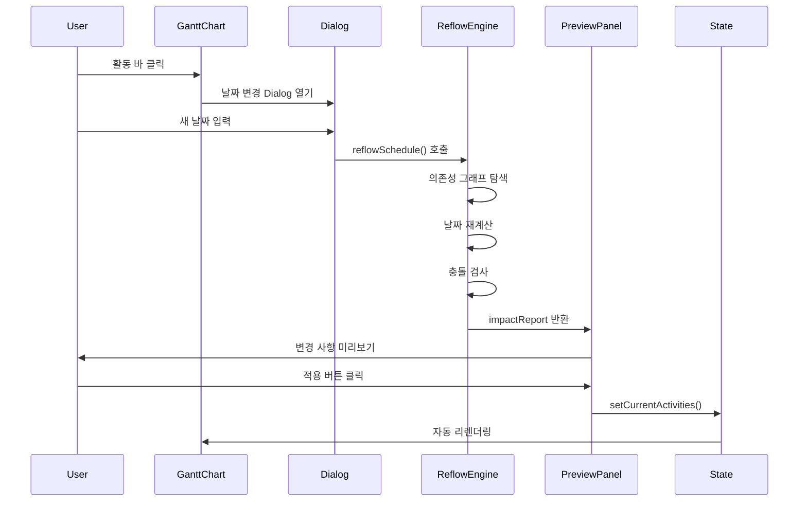
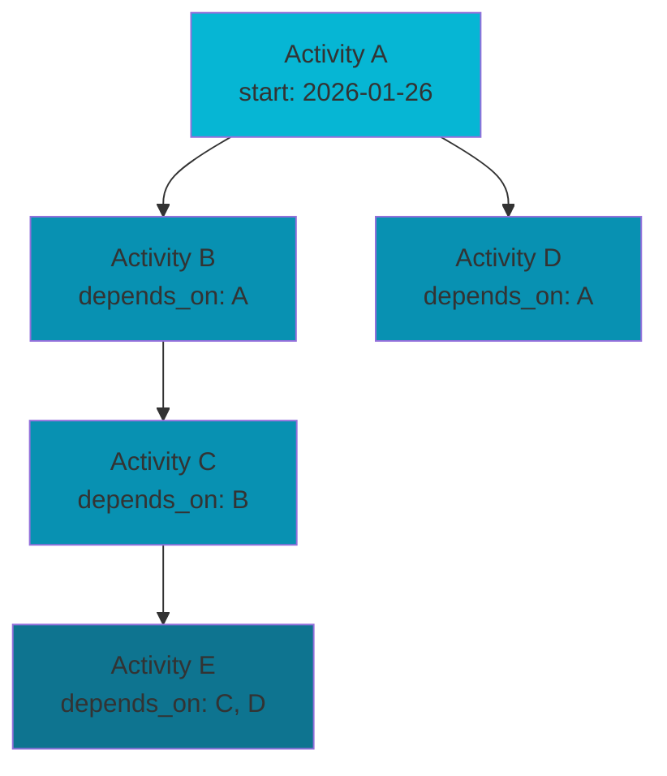

# HVDC TR Transport Dashboard - 시스템 아키텍처

**버전**: 1.1  
**최종 업데이트**: 2026-02-02  
**프로젝트**: HVDC TR Transport - AGI Site Logistics Dashboard  
**SSOT**: patch.md, option_c.json (AGENTS.md)

---

## 목차

1. [시스템 개요](#시스템-개요)
2. [아키텍처 원칙](#아키텍처-원칙)
3. [레이어 구조](#레이어-구조)
4. [데이터 흐름](#데이터-흐름)
5. [핵심 컴포넌트](#핵심-컴포넌트)
6. [상태 관리](#상태-관리)
7. [의존성 그래프](#의존성-그래프)
8. [성능 최적화](#성능-최적화)
9. [확장성 고려사항](#확장성-고려사항)

---

## 시스템 개요

### 목적

HVDC TR Transport Dashboard는 **7개의 Transformer Unit**을 **LCT BUSHRA**로 운송하는 프로젝트의 실시간 물류 대시보드입니다. 복잡한 스케줄 의존성을 관리하고, 일정 변경의 영향을 실시간으로 시각화합니다.

**운영 규모**: 1 Trip당 1 TR 운송, 총 7 Trip, SPMT 1기 운영

### 핵심 요구사항

- **실시간 스케줄 관리**: 139개 활동의 의존성 기반 자동 재계산
- **시각적 일정 표시**: Gantt 차트를 통한 7개 항차 타임라인
- **변경 영향 분석**: 일정 변경 시 영향받는 작업 자동 계산
- **불변성 보장**: 원본 데이터 보호 및 안전한 상태 업데이트

---

## 아키텍처 원칙

### 1. SSOT (Single Source of Truth)

**목적**: 데이터 중복 제거 및 일관성 보장

**구현**:
- 타입 정의: `lib/ssot/schedule.ts` - 모든 스케줄 관련 타입의 단일 정의
- 데이터 로더: `lib/data/schedule-data.ts` - `data/schedule/option_c.json`의 단일 진입점
- 중복 금지: 동일 enum/상수를 여러 파일에 정의하지 않음

**예시**:
```typescript
// ✅ 올바른 방법: SSOT에서 import
import { ScheduleActivity, AnchorType } from "@/lib/ssot/schedule"

// ❌ 잘못된 방법: 로컬에서 재정의
type ScheduleActivity = { ... } // 중복 정의 금지
```

### 2. 계산 vs 렌더링 분리

**목적**: 순수 함수로 테스트 가능성 및 재사용성 향상

**구현**:
- **계산 로직**: `lib/utils/*` - 순수 함수만 포함
  - `schedule-reflow.ts`: 스케줄 재계산 엔진
  - `schedule-mapper.ts`: 데이터 변환
- **UI 렌더링**: `components/*` - 계산 로직 금지
  - `gantt-chart.tsx`: 시각화만 담당
  - `SchedulePreviewPanel.tsx`: UI 표시만 담당

**예시**:
```typescript
// ✅ 올바른 방법: 계산 로직 분리
const result = reflowSchedule(activities, activityId, newDate, options)
setActivities(result.activities)

// ❌ 잘못된 방법: 컴포넌트 내부에서 계산
function GanttChart() {
  // 계산 로직을 컴포넌트 내부에 작성하지 않음
}
```

### 3. 컴포넌트 책임 분리

**목적**: 단일 책임 원칙 준수 및 유지보수성 향상

**구조**:
- **조립자 (Orchestrator)**: `app/page.tsx`
  - 섹션 컴포넌트 import만 수행
  - 상태 관리 및 이벤트 핸들링
- **섹션 컴포넌트**: `components/dashboard/sections/*`
  - 특정 섹션의 렌더링만 담당
  - props를 통한 데이터 수신
- **유틸 함수**: `lib/utils/*`
  - 순수 함수로 구현
  - 사이드 이펙트 없음

---

## 레이어 구조

```
┌─────────────────────────────────────────────────────────┐
│                    Presentation Layer                    │
│  ┌──────────────┐  ┌──────────────┐  ┌──────────────┐ │
│  │   app/       │  │ components/  │  │   public/    │ │
│  │  page.tsx    │  │  dashboard/  │  │   assets     │ │
│  │  layout.tsx  │  │  gantt/      │  │              │ │
│  └──────────────┘  └──────────────┘  └──────────────┘ │
└─────────────────────────────────────────────────────────┘
                          │
                          ▼
┌─────────────────────────────────────────────────────────┐
│                     Business Logic Layer                 │
│  ┌──────────────┐  ┌──────────────┐  ┌──────────────┐ │
│  │ lib/utils/   │  │ lib/data/    │  │ lib/ops/     │ │
│  │ reflow       │  │ schedule-    │  │ agi/         │ │
│  │ mapper       │  │ data        │  │ agi-schedule/ │ │
│  └──────────────┘  └──────────────┘  └──────────────┘ │
└─────────────────────────────────────────────────────────┘
                          │
                          ▼
┌─────────────────────────────────────────────────────────┐
│                      Data Layer                          │
│  ┌──────────────┐  ┌──────────────┐                   │
│  │ lib/ssot/     │  │ data/schedule/option_c.json│                   │
│  │ schedule.ts  │  │ (139 activities)                  │
│  │ types        │  │                                  │ │
│  └──────────────┘  └──────────────┘                   │
└─────────────────────────────────────────────────────────┘
```

### 레이어별 책임

#### 1. Presentation Layer
- **역할**: 사용자 인터페이스 렌더링
- **구성요소**:
  - `app/page.tsx`: 메인 페이지 조립자
  - `components/dashboard/*`: 대시보드 섹션 컴포넌트
  - `components/gantt/*`: Gantt 차트 관련 컴포넌트
- **특징**: 계산 로직 없음, props 기반 데이터 수신

#### 2. Business Logic Layer
- **역할**: 비즈니스 로직 및 데이터 변환
- **구성요소**:
  - `lib/utils/schedule-reflow.ts`: 스케줄 재계산 엔진 (reflowSchedule)
  - `lib/utils/slack-calc.ts`: ES/EF/LS/LF, critical path
  - `lib/utils/detect-resource-conflicts.ts`: 충돌 감지
  - `lib/baseline/`: Baseline/Approval 모드 (baseline-loader, freeze-policy)
  - `lib/compare/`: Compare Mode (compare-loader, types) — Phase 10 완료
- **특징**: 순수 함수, 사이드 이펙트 없음

#### 3. Data Layer
- **역할**: 데이터 정의 및 저장
- **구성요소**:
  - `lib/ssot/schedule.ts`: ScheduleActivity, ScheduleConflict, SuggestedAction
  - `src/types/ssot.ts`: Contract v0.8.0 Activity, Collision, Baseline
  - `data/schedule/option_c.json`: 마스터 스케줄 데이터
- **특징**: SSOT 원칙 준수

---

## 데이터 흐름

### 스케줄 데이터 흐름

```mermaid
graph TD
    A[data/schedule/option_c.json<br/>139개 활동] --> B[schedule-mapper.ts<br/>TR Unit, Anchor 타입 추출]
    B --> C[schedule-data.ts<br/>ScheduleActivity[] 생성]
    C --> D[scheduleActivitiesToGanttRows<br/>GanttRow[] 변환]
    D --> E[gantt-chart.tsx<br/>currentActivities 상태]
    E --> F[사용자 클릭<br/>날짜 변경 Dialog]
    F --> G[reflowSchedule<br/>의존성 기반 재계산]
    G --> H[Preview 패널<br/>변경 사항 표시]
    H --> I[적용 버튼<br/>setCurrentActivities]
    I --> E
```

### 상태 업데이트 흐름



---

## 핵심 컴포넌트

### 1. 스케줄 재계산 엔진 (`lib/utils/schedule-reflow.ts`)

**책임**: 의존성 그래프 기반 자동 일정 조정

**주요 기능**:
- **의존성 그래프 탐색**: DFS 기반 후속 작업 탐색
- **사이클 탐지**: 순환 의존성 자동 감지
- **UTC 날짜 연산**: 타임존 안전한 날짜 계산
- **Lock/Constraint 처리**: 잠금 작업 및 제약 조건 존중
- **SUMMARY rollup**: 요약 활동 자동 계산
- **불변성 보장**: 깊은 복사로 원본 데이터 보호

**API**:
```typescript
function reflowSchedule(
  activities: ScheduleActivity[],
  targetActivityId: string,
  newStartDate: IsoDate,
  options: ReflowOptions
): ReflowResult

interface ReflowResult {
  activities: ScheduleActivity[]  // 재계산된 활동 목록
  impact_report: ImpactReport      // 영향받은 작업 및 충돌 정보
}
```

**알고리즘**:
1. 타겟 활동의 새 시작일 설정
2. 의존성 그래프에서 후속 작업 탐색 (DFS)
3. 각 후속 작업의 시작일 재계산
4. Lock/Constraint 검증
5. SUMMARY 활동의 시작/종료일 rollup
6. 사이클 탐지 (옵션)

### 2. Gantt 차트 (`components/dashboard/gantt-chart.tsx`)

**책임**: 스케줄 데이터의 시각적 표현

**주요 기능**:
- **동적 데이터 렌더링**: `currentActivities` 상태 기반
- **인터랙티브 활동 바**: 호버 시 Tooltip, 클릭 시 Dialog
- **마일스톤 표시**: 주요 이벤트 마커
- **레전드**: 활동 타입별 색상 구분
- **Activity 스크롤**: `scrollToActivity()` 함수로 특정 활동으로 이동

**데이터 변환**:
```typescript
ScheduleActivity[] 
  → scheduleActivitiesToGanttRows() 
  → GanttRow[] (렌더링용)
```

### 3. ReflowPreviewPanel (`components/dashboard/ReflowPreviewPanel.tsx`)

**책임**: Why 패널 suggested_action → reflowSchedule 결과 미리보기 (Phase 7 T7.7)

**주요 기능**:
- **변경 사항 목록**: 영향받은 작업의 이전/이후 날짜
- **충돌 경고**: 의존성 사이클, 잠금 위반, 제약 조건 위반
- **적용/취소**: Preview 적용 시 상태 업데이트
- **연결**: `onApplyAction` → `reflowSchedule` → ReflowPreviewPanel 표시

### 4. DetailPanel + WhyPanel (2-click Collision UX)

**책임**: Activity inspector, Collision root cause, suggested_actions (patch.md §4.2)

**흐름**: Collision 배지 클릭 → WhyPanel → suggested_action 클릭 → reflowSchedule → ReflowPreviewPanel

---

## 상태 관리

### 상태 구조

```typescript
// app/page.tsx
const [activities, setActivities] = useState<ScheduleActivity[]>(scheduleActivities)
const [activeSection, setActiveSection] = useState<string>("overview")
const [timelineView, setTimelineView] = useState<TimelineView>("Week")
const [changeBatches, setChangeBatches] = useState<ChangeBatch[]>([])
```

### 상태 업데이트 패턴

**불변성 보장**:
```typescript
// ✅ 올바른 방법: 새 배열 생성
setActivities([...newActivities])

// ❌ 잘못된 방법: 기존 배열 수정
activities[0].start_date = newDate  // 금지
```

**배치 업데이트**:
```typescript
const handleApplyPreview = (
  nextActivities: ScheduleActivity[],
  impactReport: ImpactReport | null
) => {
  setActivities((prevActivities) => {
    // 변경 이력 저장
    if (impactReport?.changes?.length) {
      setChangeBatches((prev) => {
        const nextBatch: ChangeBatch = {
          appliedAt: new Date().toISOString(),
          changes: impactReport.changes,
          previousActivities: prevActivities,
        }
        return [...prev, nextBatch].slice(-MAX_CHANGE_STACK)
      })
    }
    return nextActivities
  })
}
```

---

## 의존성 그래프

### 그래프 구조



### 의존성 처리 알고리즘

1. **그래프 구축**: `depends_on` 배열 기반 인접 리스트 생성
2. **DFS 탐색**: 타겟 활동부터 시작하여 후속 작업 탐색
3. **위상 정렬**: 의존성 순서에 따라 처리 순서 결정
4. **사이클 탐지**: 백엣지(back edge) 탐지로 순환 의존성 발견

---

## 성능 최적화

### 1. 메모이제이션

```typescript
// useMemo로 계산 결과 캐싱
const ganttRows = useMemo(
  () => scheduleActivitiesToGanttRows(currentActivities),
  [currentActivities]
)

const changeImpactItems = useMemo(() => {
  const flattened = changeBatches.flatMap((batch) =>
    batch.changes.map((change) => ({
      ...change,
      appliedAt: batch.appliedAt,
    }))
  )
  return flattened.slice(-MAX_CHANGE_STACK).reverse()
}, [changeBatches])
```

### 2. 지연 계산

- Gantt 행 변환: 렌더링 시점에만 변환

### 3. 가상화 (향후 계획)

- 대량 활동 렌더링 시 React Window 고려
- Gantt 차트 스크롤 영역 가상화

---

## 확장성 고려사항

### 1. 데이터 확장

- **현재**: 139개 활동
- **향후**: 수백~수천 개 활동 지원 필요 시
  - 가상 스크롤링 구현
  - 페이지네이션 또는 필터링
  - 서버 사이드 데이터 로딩

### 2. 기능 확장

- **Undo/Redo**: `changeBatches` 히스토리 기반 구현 가능
- **localStorage 저장**: 상태 영속화
- **실시간 협업**: WebSocket 기반 동기화
- **다중 프로젝트**: 프로젝트별 데이터 분리

### 3. 성능 확장

- **Web Worker**: 대량 계산을 백그라운드 스레드로 이동
- **인덱싱**: 활동 ID 기반 빠른 조회를 위한 Map 구조
- **캐싱**: 재계산 결과 캐싱

---

## 기술 스택

### Core
- **Next.js 16.0.10** (App Router)
- **React 19.2.0**
- **TypeScript 5.x**

### UI
- **Radix UI**: 접근성 있는 컴포넌트
- **Tailwind CSS 4.1.9**: 유틸리티 기반 스타일링
- **Lucide React**: 아이콘

### 데이터 처리
- **date-fns 4.1.0**: 날짜 연산
- **Zod 3.25.76**: 타입 검증 (향후 확장)

---

## 보안 및 규칙

### 절대 규칙 (Hard Rules)

1. **UI 스타일 보존**: `globals.css`의 Deep Ocean Theme 변경 금지
2. **구조 보존**: `app/layout.tsx`, `app/page.tsx` 조립 패턴 유지
3. **추측 금지**: 파일/스크립트 존재 확인 전 단정 금지
4. **NDA/PII 금지**: API Key, 토큰, 계정정보, PII 기록 금지

### 커밋 규칙

- **Structural commit**: 구조 변경만 (리네이밍, 추출, 이동)
- **Behavioral commit**: 기능 추가/수정
- **분리 원칙**: 구조와 행위 변경을 동일 커밋에 포함하지 않음

---

## 참고 문서

- [README.md](./README.md) - 프로젝트 개요 및 사용 가이드
- [VERCEL.md](./VERCEL.md) - 배포 설정
- [.cursor/rules/](./.cursor/rules/) - Cursor IDE 규칙

---

**Last Updated**: 2026-02-02  
**참조**: patch.md, AGENTS.md, tr-dashboard-plan-patch4.md

### 5. Compare Mode (Phase 10 완료)

**책임**: baseline vs compare delta overlay (patch.md §2.2)

**구성요소**:
- `lib/compare/compare-loader.ts`: `calculateDelta(baseline, compare)` → added/removed/changed
- `components/compare/CompareModeBanner.tsx`: +X added, −Y removed, Z shifted, W collisions new
- `components/dashboard/gantt-chart.tsx`: `compareDelta` prop → ghost bars (changed 활동 노란 점선)
